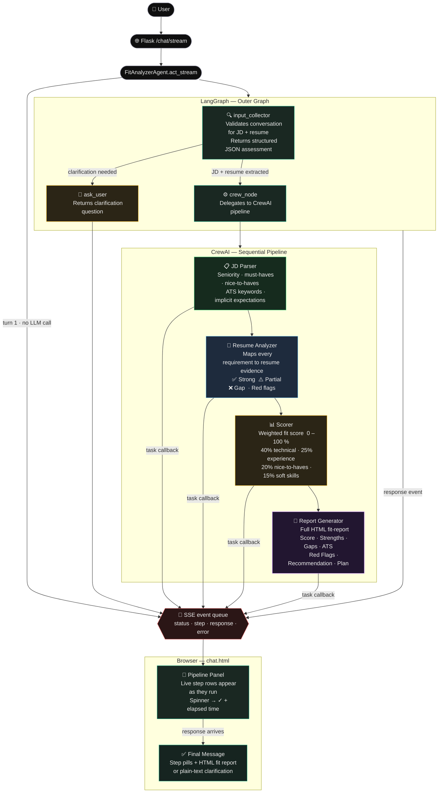
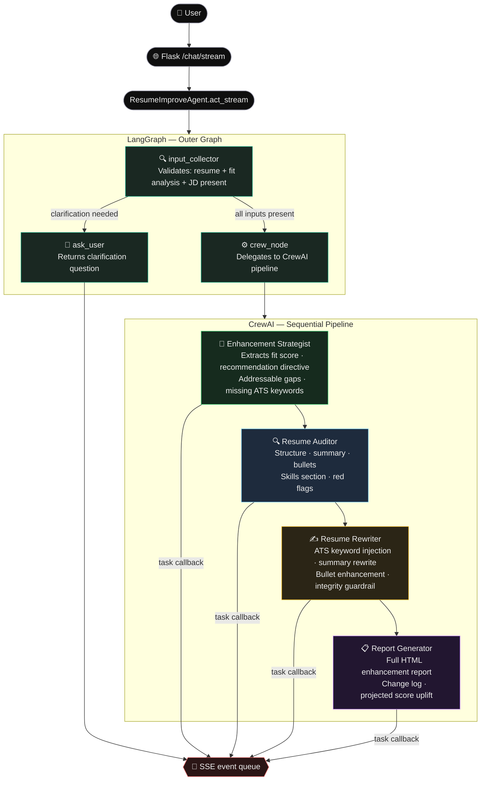

# agent-test

A minimal template for building AI agents with [LangGraph](https://github.com/langchain-ai/langgraph) and [CrewAI](https://github.com/crewAIInc/crewAI), backed by [OpenRouter](https://openrouter.ai/).

Three agents ship out of the box:

- **General Chat** (`CrewAIAgent`) — single-task CrewAI Crew; general-purpose assistant.
- **Fit Analyzer** (`FitAnalyzerAgent`) — brutally honest job-fit analyzer; LangGraph outer graph with a 4-agent CrewAI pipeline inside.
- **Resume Improver** (`ResumeImproveAgent`) — targeted ATS-optimized resume rewriter; LangGraph outer graph with a 4-agent CrewAI pipeline that rewrites and scores the improved resume.

## Project layout

```
src/agent_test/
    __init__.py
    ui.py                        # Flask web UI + per-session agent cache
    agents/
        __init__.py
        base.py                  # Abstract Agent interface
        crewai_agent.py          # General chat — single-member CrewAI Crew
        fit_analyzer/
            __init__.py
            agent.py             # FitAnalyzerAgent facade
            crew.py              # run_fit_analyzer_crew() — 4-agent CrewAI pipeline
            graph.py             # build_fit_analyzer_graph() — LangGraph outer graph
            state.py             # FitAnalyzerState TypedDict
        resume_improve/
            __init__.py
            agent.py             # ResumeImproveAgent facade
            crew.py              # run_resume_improve_crew() — 4-agent CrewAI pipeline
            graph.py             # build_resume_improve_graph() — LangGraph outer graph
            state.py             # ResumeImproveState TypedDict
    templates/
        chat.html                # Single-page chat UI
    utils/
        __init__.py
        logger.py
        openrouter_client.py     # get_chat_model(), get_crew_llm()

tests/
    __init__.py
    conftest.py                  # Shared LLM stubs (FixedLLM, JsonLLM)
    test_agent.py                # Cross-agent smoke tests
    test_ui.py                   # Flask UI tests
    agents/
        fit_analyzer/
            test_agent.py
            test_crew.py
            test_input_parsing.py
            test_state.py
        resume_improve/
            test_agent.py
            test_crew.py
```

## Getting started

1. Install dependencies:
   ```bash
   poetry install
   ```

2. Add your OpenRouter API key to `local_test.env`:
   ```env
   OPENROUTER_API_KEY=sk-or-your-key
   ```

3. Launch the web UI:
   ```bash
   poetry run python -m agent_test.ui
   ```
   Open `http://localhost:5000` in your browser.

4. Run the tests:
   ```bash
   poetry run pytest
   ```

## Architecture

### General Chat (`CrewAIAgent`)

A thin wrapper around a single-member CrewAI Crew. Each `act()` call creates a fresh `CrewAgent` + `Task` + `Crew` to avoid state bleed between turns, then streams the result back as a plain string.

```
User message
    └── CrewAIAgent.act()
            └── CrewAI Crew (fresh per call)
                    └── CrewAgent (role/goal/backstory) ── crewai.LLM (OpenRouter via LiteLLM)
```

### Fit Analyzer (`FitAnalyzerAgent`)

A two-layer pipeline: LangGraph routes the conversation; CrewAI does the heavy reasoning.



### Resume Improver (`ResumeImproveAgent`)

Same two-layer pattern as `FitAnalyzerAgent`. Takes a resume, a Job Fit Analysis report, and the original JD, then rewrites the resume to maximize ATS alignment.



**LLM split (both agents):** LangGraph nodes use `ChatOpenRouter` (LangChain `BaseChatModel`); CrewAI agents use `crewai.LLM` (LiteLLM-backed). CrewAI 0.100+ no longer accepts a LangChain model directly.

### Key modules

| File | Responsibility |
|---|---|
| `agents/base.py` | `Agent` ABC — defines `act(observation, history)` |
| `agents/crewai_agent.py` | `CrewAIAgent` — general chat; fresh Crew per turn |
| `agents/fit_analyzer/agent.py` | `FitAnalyzerAgent` — public facade; wires LangChain + crewai.LLM |
| `agents/fit_analyzer/graph.py` | `build_fit_analyzer_graph(llm, crew_llm)` — LangGraph outer graph |
| `agents/fit_analyzer/crew.py` | `run_fit_analyzer_crew(llm, jd, resume)` — 4-agent CrewAI pipeline |
| `agents/fit_analyzer/state.py` | `FitAnalyzerState` TypedDict |
| `agents/resume_improve/agent.py` | `ResumeImproveAgent` — public facade; same pattern as FitAnalyzerAgent |
| `agents/resume_improve/graph.py` | `build_resume_improve_graph(llm, crew_llm)` — LangGraph outer graph |
| `agents/resume_improve/crew.py` | `run_resume_improve_crew(llm, resume, fit_analysis, jd)` — 4-agent CrewAI pipeline |
| `agents/resume_improve/state.py` | `ResumeImproveState` TypedDict |
| `utils/openrouter_client.py` | `get_chat_model()` → `ChatOpenRouter`; `get_crew_llm()` → `crewai.LLM` |
| `ui.py` | Flask app — per-session agent cache; full history passed to `act()` |

## Using the agents in code

```python
from agent_test.agents import CrewAIAgent, FitAnalyzerAgent, ResumeImproveAgent

# General chat
agent = CrewAIAgent()
reply = agent.act("Explain LangGraph in one sentence.")

# Multi-turn
history = [
    {"role": "user",      "content": "Hi"},
    {"role": "assistant", "content": "Hello! How can I help?"},
]
reply = agent.act("What is CrewAI?", history=history)
```

```python
# Fit Analyzer — turn 1 (no inputs yet)
agent = FitAnalyzerAgent()
print(agent.act("hi"))
# → "Please paste the full job description and your resume …"

# Turn 2 — paste JD + resume
reply = agent.act(jd_and_resume_text, history=history)
# → Full structured 🎯 JOB FIT ANALYSIS report
```

```python
# Resume Improver — paste resume, fit analysis, and JD together
agent = ResumeImproveAgent()
print(agent.act("hi"))
# → "Please provide: 1. Your current resume  2. Your Job Fit Analysis output  3. The original JD"

reply = agent.act(resume_and_fit_analysis_and_jd, history=history)
# → Full structured 📋 RESUME ENHANCEMENT REPORT
```

### Customising the chat agent

```python
agent = CrewAIAgent(
    role="Senior Python engineer",
    goal="Provide expert-level Python advice.",
    backstory="You have 15 years of Python experience and love clean code.",
    model="openai/gpt-4o",
    temperature=0.0,
)
```

## Testing

All tests are fully offline — real LLM calls are never made.

- **LangGraph nodes** are tested by injecting `JsonLLM` (returns a fixed JSON string) or `FixedLLM` (returns a fixed string) from `tests/conftest.py`.
- **CrewAI agents** are tested by patching `CrewAgent`, `Task`, and `Crew` simultaneously to bypass pydantic construction validation in CrewAI 0.100+.

```bash
poetry run pytest -v
```

## Web UI

The Flask app at `ui.py` provides a chat interface with three session types selectable from the sidebar:

- **New chat** — creates a `CrewAIAgent` session
- **Fit Analyzer** — creates a `FitAnalyzerAgent` session
- **Resume Improver** — creates a `ResumeImproveAgent` session

**Session management:**
- Multiple named sessions live in the sidebar; sessions can be renamed or deleted.
- Conversation history is stored server-side in `_history_store` (avoids Flask's 4 KB cookie limit — HTML fit reports can be several kilobytes).
- History is persisted to `conversation_history.json` at the project root so it survives server restarts.
- Agents are compiled once per session and cached in `_agent_cache`; deleting a session evicts its agent.

**Live step streaming:**
- The `/chat/stream` endpoint streams SSE events (`status`, `step`, `response`, `error`) as the agent works.
- The UI renders a live **pipeline panel** showing each analysis step (Analyzing input → Running pipeline → Parsing JD → Analyzing resume → Scoring fit → Generating report) with a spinner for the active step, a checkmark + elapsed time for completed steps, and a live elapsed timer in the header.
- Once the final answer arrives the panel is replaced by compact step pills above the response.

## Extending

- **Add a new agent**: subclass `Agent` in `base.py`, implement `act(observation, history)`, register in `agents/__init__.py` and add a button in `chat.html`.
- **Add graph nodes**: extend `fit_analyzer/graph.py` or `resume_improve/graph.py` with additional nodes.
- **Add state fields**: update `FitAnalyzerState` in `fit_analyzer/state.py` or `ResumeImproveState` in `resume_improve/state.py`.

> Never commit `local_test.env` or `conversation_history.json` — both are already listed in `.gitignore`.
